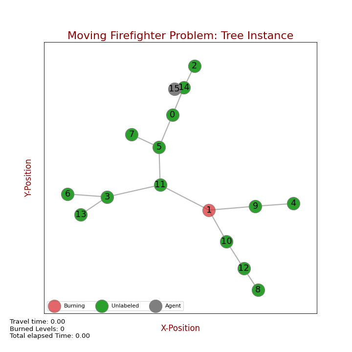

# Moving Firefighter Problem: Integer Linear Programming Solution for Trees

<p align="center">
    <a href="images/logo_MFFP.png"></a>
    <br />
    <br />
    <a href="https://semver.org/"></a>
    <a href="http://choosealicense.com/licenses/mit/"></a>
    <a href="https://github.com/psf/black"></a>   
    <br />
    <br />
</p>

---
## Moving Firefighter problem

The Moving Firefighter problem (MFFP) is a generalization of the original Moving Firefighter problem proposed by Bert Hartnell in 1995 which 
consists in a defense strategy against a propagation model (fire, flood, infectious disease, etc.) in a graph.
Given a graph *G=(E,V)* , a set of starting fire nodes $f \in V$, and a initial agent position *p*, at each consecutive discrete time step, 
the fire propagates from each burning vertex to all neighbor nodes unless they are defended by the agent. Once a vertex is burned or defended, they will
remain on this state until fire can no longer spread. On the original problem the agent can move instantaneously between each pair of nodes, on *MFFP*
we have a notion of distance or cost to travel making the problem more restrictive. The main goal of the problem is to save the most of the nodes that are part of the graph by giving a solution path of the agent.

*ILP_Tree_MFFP* is an Integer Linear Programming solution for *MFFP* which add seven restrictions to the solution space and uses [PulP](https://coin-or.github.io/pulp/) to describe the Optimization Problem. PuLP can call any of numerous external LP solvers (CBC, GLPK, CPLEX, Gurobi, etc.) to solve this model and then use python commands to manipulate and display the solution.


<p align="center">
  <a href="images/frame_0.png"></a>
  <p align="center"><em>Fig. 1 - Example Instance for Moving Firefighter Problem.</em></p>  
</p>

<p align="center">
  <a href="images/MFFP_example.gif"></a>
  <p align="center"><em>Fig. 2 - Solution found by *ILP_Tree_MFFP* which consists on the following path S={15,11,4,8} and saving 11 nodes.</em></p>  
</p>

---

## Usage

```terminal
python MFFP_Tree.py
```

---

## Instances

We can create our own instance or load one by changing the *load* variable status: True for load an instance or False to create a new one.
```python
load = False
instance = utils.generateInstance(load)

T = instance[0]
N = instance[1]
starting_fire = instance[2]
T_Ad_Sym = instance[3]
seed = instance[4]
scale = instance[5]
a_x_pos = instance[6]
a_y_pos = instance[7]
```
Here, *T* is a networkx Tree structure, *N* is the number of nodes, *starting_fire* is the set of initial burning nodes (default=1), *T_Ad_Sym* is our matrix containing all distances (including those who corresponds to the initial agent position *a_x_pos* and *a_y_pos*) and *scale* is only for scaling distances.

If we decide to load an instance we need a folder called *instance* with the following files:
  - *layout_MFF.json* containing the Tree position layout for reproducibility.
  - *FDM_MFFP.npy* which is our distance matrix (agent distances must be the last row-column)
  - *instance_info.json* containing instance relevant information to create ILP problem. Info must be in this order:
    - 'N' = number of nodes
    - 'seed' = seed for reproducibility
    - 'scale'=scale of distances
    - 'start_fire'=starting fire nodes
    - 'a_pos_x'= agent position on x axis
    - 'a_pos_y'= agent position on y_axis


---
## Configuring a solver

By Default PulP uses 'CBC (Coind or branch and cut)' solver but it can be configured to use others by:

```python
path_to_cplex = r'C:\Program Files\IBM\ILOG\CPLEX_Studio128\cplex\bin\x64_win64\cplex.exe'
import pulp as pl
model = pl.LpProblem("Example", pl.LpMinimize)
solver = pl.CPLEX_CMD(path=path_to_cplex)
    # Here must be the constraints
    #
result = model.solve(solver)
```

---

## On Progress
- Make experiments with incremental nodes and solvers. 🚧
- Include different types of Tree generators. 🚧
- Include animations with 'manim' library. 🚧
